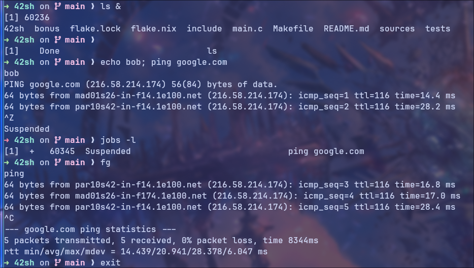

# 42sh

An interactive Linux shell written in C


## Summary

This project is an Epitech Project aimed at rewriting a linux shell in C
from scratch.
It's based on both minishell and minishell2 projects at Epitech.
The goal was to push further the features for the user like improved syntax,
autocompletion, history, etc.

## Features

- [x] Commands and arguments
- [x] Environment variables
- [x] Pipes
- [x] Redirection
- [x] History
- [x] History navigation
- [x] Colors
- [x] Builtins
- [x] Prompt editing
- [x] Job controls
- [x] Globbings
- [ ] Autocompletion
- [ ] Aliases

## Capabilities

It handles the following builtins:

* cd
* pwd
* env
* setenv
* unsetenv
* exit
* which

It also handles the following syntax:

* `>`, `>>`, `<` for redirection
* `|` for pipes
* `;` to separate commands
* `||` as the OR operator
* `&&`as the AND operator
* `*` for the globbings
* `!` to load a command from the history

You can start the shell with a command already typed (`-c` as second parameter, third parameter should be the command to run).

```bash
./42sh -c "echo hello"
hello
```

## Compilation

*Need to have gcc installed*
```bash
git clone git@github.com:dawpitech/42sh.git
cd 42sh
make -j
```
```bash
./42sh
```
Or using the provided nix flake:
```nix
nix run github:dawpitech/42sh
```
